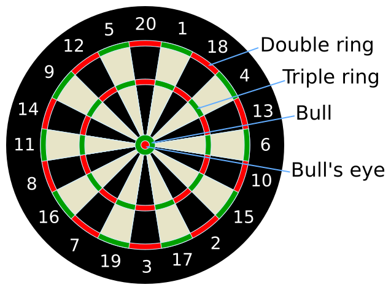

# Dart Calc

Im Projekt _Dart Calc_ geht es um Berechnungen rund um das Spiel _Darts_. Dabei
soll bestehender ‒ funktionierender, aber schlechter ‒ Code verbessert werden.
Es werden Unit Tests zur Verfügung gestellt, sodass das Verbessern des Codes
furchtlos angehen kann.

## Spielvariante 501: Regeln

Bei der Spielvariante _501_ geht es darum, mit möglichst wenig Würfen von 501
auf null Punkte zu kommen. Das Spiel funktioniert (vereinfacht für einen
Spieler) folgendermassen:

1. Der Spieler wirft dreimal mit je einem Pfeil auf das Brett.
2. Die Anzahl Punkte für die Runde wird berchnet und vom Zwischenstand (zu
   Beginn: 501) abgezogen.
    1. Bei einem Treffer in einen bestimmten Sektor erhält der Spieler die
       einfache Punktzahl (z.B. _Single 18_: 18).
    2. Wird der _Double Ring_ getroffen, erhält der Spieler die doppelte
       Punktzahl des Sektors (z.B. _Double 17_: 34).
    3. Wird der _Triple Ring_ getroffen, erhält der Spieler die dreifache
       Punktzahl des Sektors (z.B. _Tripe 20_: 60).
3. Die Runde ist zu Ende, wenn der Spieler auf null Punkten ist.
    1. Die Punktzahl 0 muss _exakt_ erreicht werden. Wird die Punktzahl 0
       unterschritten, gibt es keine Punkte.
    2. Die Punktzahl 0 muss über einen _Double Checkout_ erreicht werden, d.h.
       mit dem letzten Wurf muss man den _Double Ring_ treffen. (D.h. man kann
       die Runde nur beenden, wenn beim letzten Wurf eine gerade Punktzahl
       verbleibt.)

## Berechnungen

Im vorliegenden Projekt geht es um zwei Berechnungen:

1. Berechnung der Punktezahl aus einer Runde anhand einer Zeichenkette.
    - Der Spieler gibt seine Treffer im folgenden Format ein (Beispiele):
        - `3 20 1 17 2 4`: _Triple 20_, _Single 17_, _Double 4_: `3*20+1*17+2*4=85`
        - `2 15 1 18 3 19`: _Double 15_, _Single 18_, _Triple 19_: `2*15+1*18+3*19=105`
        - `3 20 1 5`: _Tripe 20_, _Single 5_, [einmal daneben]: `3*20+1*5=65`
        - D.h. Multiplikator und Sektor wechseln sich jeweils ab.
    - Eine Funktion soll aus dem String die Punktezahl berechnen.
2. Ermittlung eines Treffers für den _Double Checkout_ bei gegebener Punktzahl.
    - Der Spieler hat bisher eine bestimmte Punktezahl `x` geworfen.
    - Es verbleiben noch eine bestimmte Anzahl Punkte (`501-x`).
    - Es soll berechnet werden, mit welchem Wurf die Runde mittels _Double
      Checkout_ beendet werden kann.
    - Beispiel: `x=477`, `501-477=24`, `24:2=12`, _Double 12_
    - Beispiel: `x=480`, `501-480=31`, `31:2=15.5`, [unmöglich, da ungerade]
    - Beispiel: `x=441`, `501-441=60`, `60:2=30`, [unmöglich, da `30>20`]

## Projekte

In den folgenden Unterordnern gibt es zwei Implementierungen:

1. `csharp/`: C#
    - Test: `DartCalc.Tests/ScoreTest.cs`
        - `test_calc`
        - `test_checkout`
    - Implementierung: `DartCalc/Score.cs`
        - `calc`
        - `checkout`
    - Tests ausführen: `dotnet test`
2. `python/`: Python
    - Test: `tests/test_score.py`
        - `TestCalc`
        - `TestCheckout`
    - Implementierung: `dartcalc/score.py`
        - `Calc`
        - `Checkout`
    - Virtuelle Umgebung einrichten: `python -m venv env`
    - Virtuelle Umgebung aktivieren (PowerShell): `env/Scripts/Activate.ps1`
    - Virtuelle Umgebung aktivieren (Bash): `env/Scripts/activate`
    - `pytest` installieren: `pip install pytest`
    - Tests ausführen: `pytest`

Bei den Testfällen handelt es sich um _parametrisierte Tests_. Hierbei wird der
gleiche Test für mehrere Eingabe- und Erwartungswerte eingeführt. **An den Tests
brauchen Sie nichts zu ändern.**

Die Implementierungen sind rein technisch soweit korrekt, zumal sie alle
Testfälle befriedigen. **Der Code ist jedoch mangelhaft.**

## Aufgabe

Verbessern Sie die Implementierungen der beiden Berechnungen, ohne dabei die
Testfälle zum Scheitern zu bringen.
